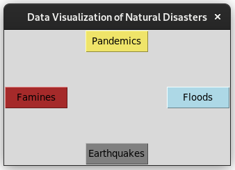
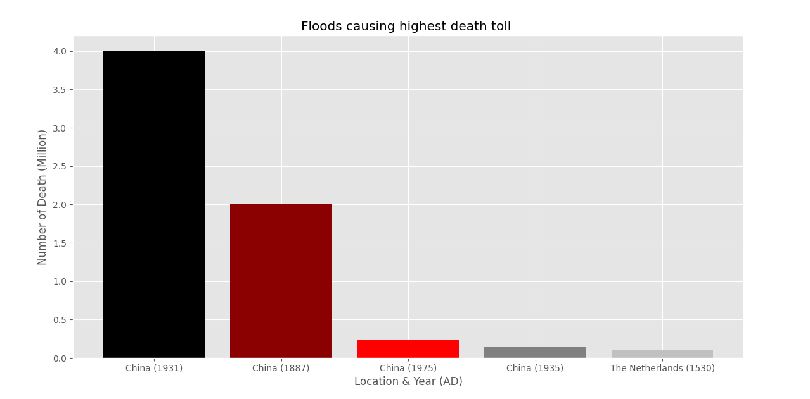
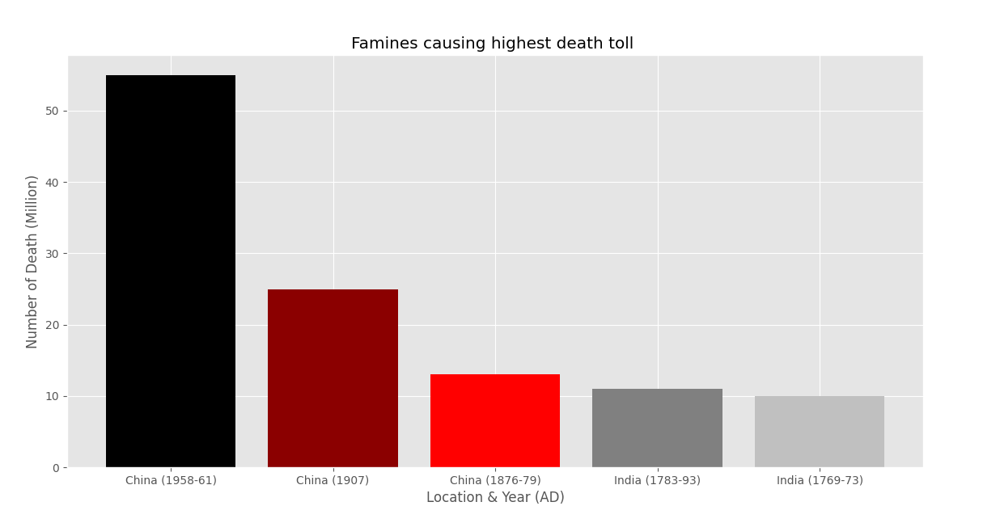
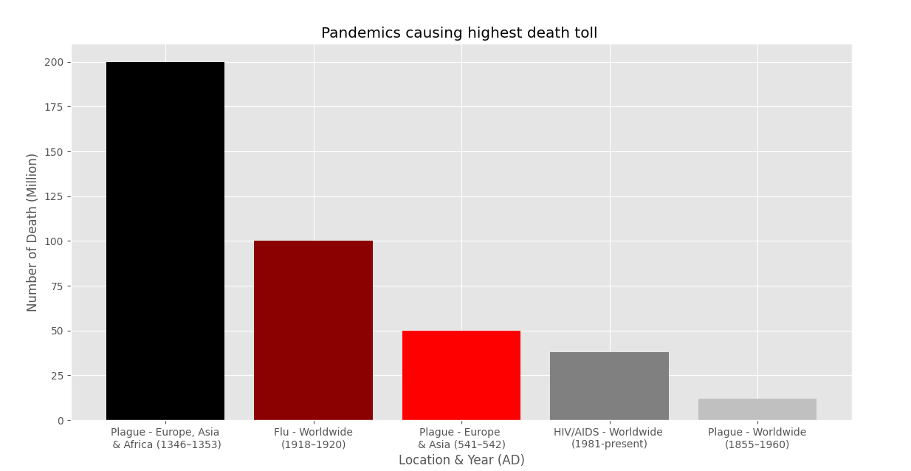
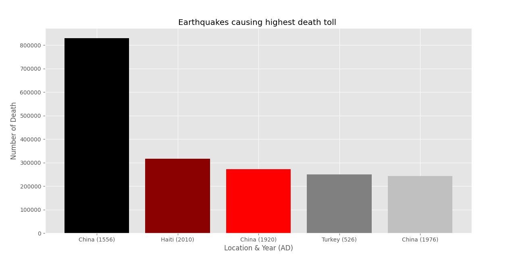

## Natural Disasters Visualization
#### Desktop app built using Python, tkinter & matplotlib

This repository consists of Python programs to visualize data i.e. number of death toll caused by natural disasters worldwide. Wikipedia's help has been taken to collect the data.

## Requirements:

1. Python 3.x
2. tkinter (for GUI)
3. matplotlib (data visualization)

## How To Use:

1. Open your terminal on Windows
2. Run: python3 dashboard.py
3. Choose from the options to visualize

#### Note: It can also be used on Linux and MacOS as long as the requirements are installed.

## Screenshots:

### Dashboard View

### Flood Data Visualization

### Famine Data Visualization

### Pandemic Data Visualization

### Earthquake Data Visualization

